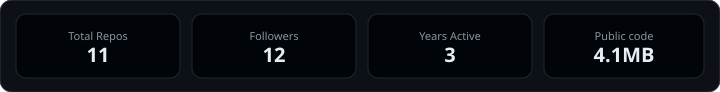
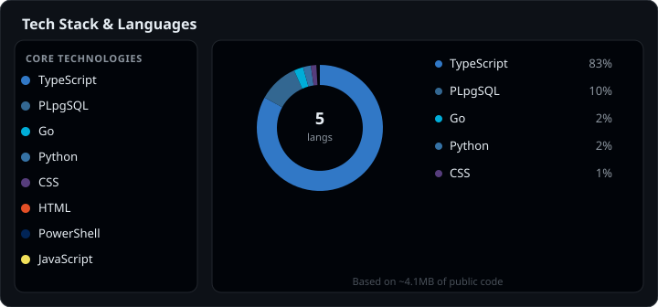

# Hi, I'm Francisco Simas

I like to build things that solve real problems, keep them working, user-friendly and as automated as possible. From networks and infrastructure to full web products on my own time.

📍 Ribeira Grande, Portugal · 🪪 [CCNA](https://www.credly.com/users/francisco-simas) · [CyberOps Associate](https://www.credly.com/users/francisco-simas)  
🔗 Portfolio view: [checkmygit.com/FranciscoSimas](https://checkmygit.com/FranciscoSimas)

---

## Overview

  

  

---

## Tech Stack & Languages

  

---

## Notable Projects

| Project | What it is |
|---|---|
| **[Predz](https://github.com/FranciscoSimas/Predz-P)** | Football predictions for friends · TanStack / Supabase / Go sync · [predz.app](https://predz.app) |
| **[PokeLead](https://github.com/FranciscoSimas/pokelead)** | Pokémon GO PvP draft assistant · Next.js / Supabase / PvPoke ranks |
| **[FitTracker](https://github.com/FranciscoSimas/FitTracker)** | Workout plans, history and progress · React / Supabase / PWA |
| **[Money Map](https://github.com/FranciscoSimas/money-map-P)** | Personal finance in one place · React / Supabase |
| **[Ordem Hub](https://github.com/FranciscoSimas/Ordem-cris-hub)** | Fan tools for Ordem Paranormal · React / Supabase |
| **[EV Tracker](https://github.com/FranciscoSimas/ev-tracker-eda)** | EV charging costs and EV vs combustion · React / Supabase |

---

## What I work with

`TypeScript` · `React` · `Next.js` · `Supabase` · `PostgreSQL` · `Go` · `Python` · `Docker` · `Kubernetes` · `Linux` · `GitHub Actions` · `Vercel` · `Networking (Cisco / Huawei)`

Day job: DCIM / STOCK platforms, network automation, APIs and field ops.  
Side projects: product-shaped web apps with auth, real databases and CI.

---

## Currently

- Shipping and pausing **Predz** between football seasons  
- Improving **PokeLead** as a box-first PvP helper  
- Automating network / inventory work at NOS Açores  
